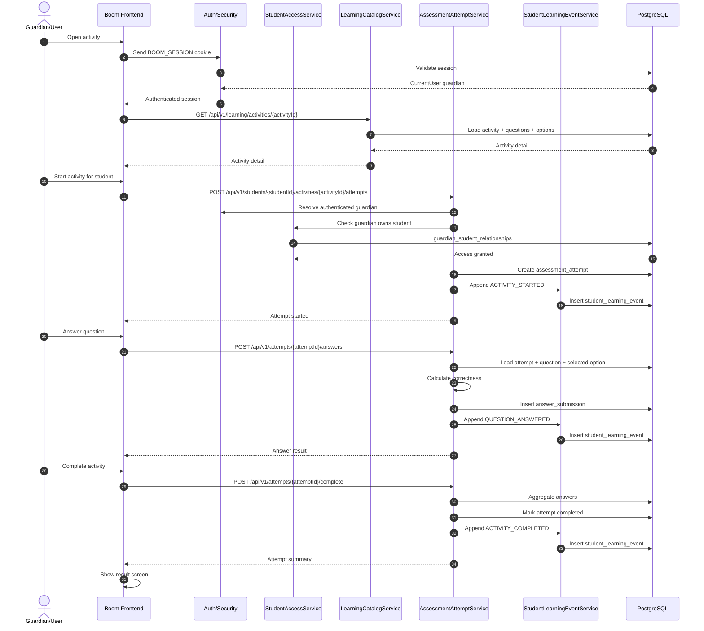

# Learning Execution Sequence Diagram

## Notes

- The event service should receive enough context to create a complete analytical event.
- The attempt service owns correctness calculation.
- The student access service protects student ownership.
- The event table is the source for analytics, not the transactional source for attempt state.
